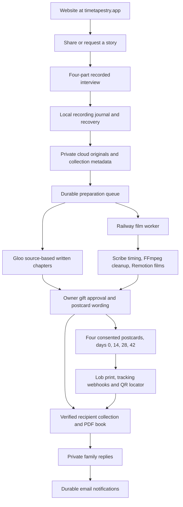

# Time Tapestry product map and build plan

This map describes the code inspected on October 6, 2026. An implemented route or
passing local test does not establish that a provider is configured or that a real
email, render or postcard has completed. Verification results belong in the QA log.

## Current system

| Area | Existing implementation | Important boundary |
| --- | --- | --- |
| Web app | Next.js 15, React 19, Tailwind, existing Time Tapestry components | Vercel serves the app; public origin must be timetapestry.app. |
| Identity | Browser-bound email magic links, account session cookies, owner/requester capabilities | Recipient links and QR codes locate a collection, never authorize it by themselves. |
| Persistence | KV record storage and serialized mutations; private Vercel Blob media; local development disk | Production fails closed if durable storage is absent. Browser IndexedDB is recovery support. |
| Interview | ElevenLabs adaptive conversation or guided individual audio/video takes | Storyteller voice is the only source for finished family films. |
| Story preparation | Durable preparation records, Gloo editing with source references | Written text is read-only to users. Postcard encouragement remains editable. |
| Four films | Railway Node worker, ElevenLabs Scribe, FFmpeg, Remotion, existing animated closer | Verified source timings; preserve originals; stop on uncertain inputs rather than invent speech. |
| PDF keepsake | pdf-lib and embedded brand font, personalized cover, contents, source quotes, four original chapters and published additions | Authenticated, private, generated from approved content, no recipient directory or secrets. |
| Postcards | Lob, frozen print proofs, public-message consent, biweekly cadence | Test mode and mailing disabled remain distinct from scheduled or actually mailed. |
| Email | Resend, durable notification queue, retry and idempotency state | Provider acceptance is not inbox delivery. Worker runs delivery checks independently of renders. |
| Operations | Admin collection list/detail, delivery status, audited media access/export | Named administrator sessions are required on every privileged route. |
| CI and hosting | GitHub Actions, Vercel web deployment, Railway worker container | Main branch tests and deployment status must be checked after merge. |

## New living-story feature

The original four-chapter gift stays stable. New memories are additions to the same
private collection, not replacements for already approved chapters or another set of
physical postcards. This keeps family links stable and prevents unexpected mailings.

1. The original four-part gift must be completed and shared first. An authorized recipient then browses 100 original story prompts in seven categories:
   Character, Health, Relationships, Finances, Happiness, Meaning and Faith.
2. They select one to three prompts. The collection has one open family request at a
   time, preventing several recipients from overwhelming the storyteller. All active
   recipients can see the pending questions, but not each other's private replies or
   email addresses. The request is attributed by supplied display name only.
3. The storyteller receives one invitation to record, can answer one question at a
   time in audio or video, and can decline a question without losing other answers.
   No typed substitute and no synthesized storyteller voice.
4. The storyteller can browse the same library and start their own recordings even
   without a family request. Original saves and submission are separate states.
5. Submission validates ownership, attached media and durable save status. A leased
   worker prepares source-timed original audio/video, a readable animated question
   opener, the branded closer and a faithful written chapter. Both outputs must pass
   before publication. A durable notification
   is queued for each still-authorized member. Revoked members receive neither access
   nor queued email. Duplicate submission must not duplicate content or notifications.
6. Published stories join a searchable catalog with category filters, individual
   film downloads and a Watch all playlist. They append to the personalized PDF; the
   original book and earlier publication editions remain downloadable. A single
   concatenated MP4 export is a later enhancement, not a promise in this release.
7. Once a request is answered or closed, family can request another group of up to
   three. New moments do not reopen the four-chapter approval or reset postcard dates.

The categories are inspired by Gloo's flourishing framework. These original prompts
invite memories, decisions, relationships, prayers and values. They are not a clinical
assessment, a financial questionnaire or a claim that Time Tapestry is a validated
flourishing intervention. Questions about faith and difficult memories remain optional.
No prompt asks for account numbers, balances, diagnoses or another person's secrets.

Research: [Gloo flourishing framework](https://gloo.com/press/releases/new-flourishing-ai-benchmark-measures-performance-of-top-llms-across-key-dimensions-of-human-well-being),
[Harvard measurement background](https://hfh.fas.harvard.edu/post/how-to-measure-well-being).

## Administration

Use the existing email verification service for named administrator access. Exact
server-side allowlist: team@foronestudios.com and kbrooks@gloo.us, both explicitly confirmed. A typed address is never proof of identity. Require a
verified, unexpired account session on every admin route and media download. Audit
privileged reads and exports. Do not expose raw account tokens or private Blob URLs.

Extend the existing backend rather than create a second source of truth. Operators
need collection/preparation state, failed jobs, originals, films, PDF access, digital
notification status, Lob IDs and real tracking state. Keep retries deliberate and
idempotent. Never label test postcards as shipped or silently resend ambiguous jobs.

## Execution and release gates

1. Finish and validate the current recording/resume fixes.
2. Audit film output safety, story/PDF quality, postcard route/schedule and identity.
3. Build prompt catalog and request/response lifecycle behind existing authorization.
4. Build the simple family prompt picker and one-question recording flow.
5. Replace shared-secret admin entry with named magic-link access and verify auditing.
6. Run isolated integration, abuse/access, retry, mobile and media edge-case checks.
7. Commit, run CI, merge main, and inspect Vercel/Railway deployment results.
8. Record provider checks separately. Do not trigger real paid mail as a QA side effect.

Work ownership: film specialist audits/repairs media pipeline; lifecycle specialist
owns living-story data/API/notification behavior; access specialist owns admin identity
and operations; lead owns prompt content, family UI, integration, PDF/Lob assessment,
release and final evidence. Shared types or delivery-file edits require coordination.

## Design reference decisions

The existing Time Tapestry brand remains primary. Refero references informed the
hierarchy, not a replacement palette or type system.

- Headspace: generous spacing and comfortable controls for a single next action.
- ChatGPT: one question at a time in a conversation, with optional controls secondary.
- [Anthropic prompt library](https://refero.design/pages/742c2ad6-e94c-46ce-8f22-b5553d7cadbb)
  and [filtered view](https://refero.design/pages/62aa7bf9-1e8a-470d-95a2-740f2247686a):
  short question cards beneath search and category controls. Show a small group at
  once, not a wall of 100 questions.
- [Kit selection flow](https://refero.design/flows/2256): visible maximum-three
  selection count, removable selections and a clear single save/send action.

Do not adopt foreign branding, dense dashboard conventions, chat-model terminology,
or decorative controls that distract from recording and finding family stories.
